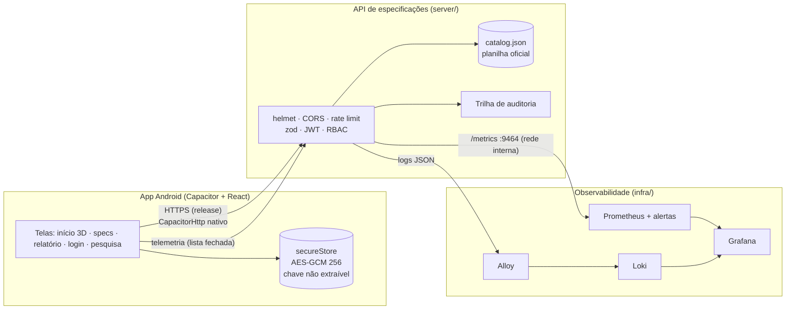
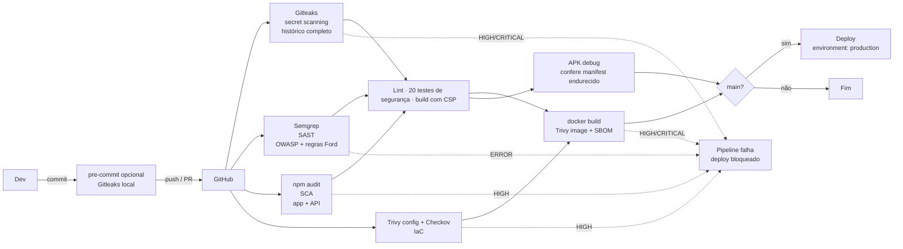
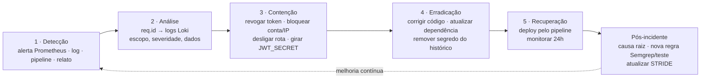

# Sprint 3 — Cybersecurity (DevSecOps)

**Projeto:** Ford Ranger Raptor — Desafio 01 (Inteligência Competitiva Automotiva) · FIAP × Ford
**Repositório:** https://github.com/VictorMLCapp/Challenge_Mobile
**Integrantes:** Victor Mattenhauer Lopes Capp (RM 555753) · Artur Alves Tenca (RM 555171) · Igor Brunelli Ralo (RM 555035) · João Pedro Signor Avelar (RM 558375) · Roger Cardoso Ferreira (RM 557230)

> Todos os trechos de código citados existem no repositório. O pipeline DevSecOps rodou no GitHub Actions com **os 9 jobs aprovados**: [execução 36359884511](https://github.com/VictorMLCapp/Challenge_Mobile/actions/runs/36359884511). O item 5 traz o checklist de conformidade com a evidência de cada controle.

---

## Sumário

0. [Contexto e arquitetura](#0-contexto-e-arquitetura)
1. [Atividade 1 — Pipeline DevSecOps Integrado (peso 3,0)](#1-atividade-1--pipeline-devsecops-integrado-peso-30)
2. [Atividade 2 — Segurança em Código e Infraestrutura (peso 2,5)](#2-atividade-2--segurança-em-código-e-infraestrutura-peso-25)
3. [Atividade 3 — Observabilidade, Monitoramento e Resposta (peso 2,0)](#3-atividade-3--observabilidade-monitoramento-e-resposta-peso-20)
4. [Atividade 4 — Compliance, Riscos e Segurança Contínua (peso 2,5)](#4-atividade-4--compliance-riscos-e-segurança-contínua-peso-25)
5. [Checklist de conformidade](#5-checklist-de-conformidade)
6. [Como reproduzir as evidências](#6-como-reproduzir-as-evidências)

---

## 0. Contexto e arquitetura

O Desafio 01 pede uma ferramenta que receba **marca, modelo, versão e uma lista livre de atributos** e devolva uma **lista padronizada de especificações**, sempre no mesmo formato, deixando explícito o que não existe. A validação é feita com a **Ford Ranger Raptor**.

Antes desta sprint, o repositório era só o app (React + Vite + react-three-fiber, empacotado como APK com Capacitor), com os dados fixos em `src/data/ranger.json` e **sem backend**. Por isso não havia onde aplicar autenticação, rate limit, JWT ou RBAC. Nesta sprint:

- criamos a **API de especificações** (`server/`, Node 22 + Express 5), que implementa o próprio Desafio 01 a partir da planilha oficial `FIAP-Ford - Data sheet_Desafio_01_v02.xlsx` (gerador: `server/scripts/build_catalog.py`) e da ficha da Raptor do app;
- o **app mobile** ganhou login e a tela **Pesquisar concorrência**, que consomem a API;
- toda a segurança foi aplicada nas duas pontas e automatizada no pipeline.



**Fluxo principal (Desafio 01):** `POST /api/specs/search`

```json
{ "marca": "Ford", "modelo": "Ranger", "versao": "Raptor",
  "atributos": ["Potência", "Torque", "Teto Solar Elétrico", "Autonomia em Marte"] }
```

```json
{
  "encontrado": true,
  "veiculo": { "id": "ford-ranger-raptor-3-0-v6", "marca": "Ford", "modelo": "Ranger", "versao": "Raptor 3.0 V6", "fonte": "src/data/ranger.json (ficha exibida no app)" },
  "totalAtributos": 4, "disponiveis": 2, "naoDisponiveis": 2,
  "especificacoes": [
    { "atributo": "Potência", "valor": 397, "unidade": "cv", "categoria": "Engine & Transmission", "status": "DISPONIVEL" },
    { "atributo": "Torque", "valor": 583, "unidade": "Nm", "categoria": "Engine & Transmission", "status": "DISPONIVEL" },
    { "atributo": "Teto Solar Elétrico", "valor": null, "unidade": null, "categoria": null, "status": "NAO_DISPONIVEL" },
    { "atributo": "Autonomia em Marte", "valor": null, "unidade": null, "categoria": null, "status": "NAO_DISPONIVEL" }
  ]
}
```

O teste `server/test/specs.test.js` confirma que as **18 especificações da ficha da Raptor voltam todas como `DISPONIVEL`**. O app mostra o mesmo resultado na tela, pelo botão “Usar ficha da Ranger Raptor”.

---

## 1. Atividade 1 — Pipeline DevSecOps Integrado (peso 3,0)

**Arquivo:** `.github/workflows/devsecops.yml` (GitHub Actions)

### 1.1 Desenho do pipeline



**Gatilhos:** push em `main`/`develop`, todo Pull Request para `main`, execução semanal (segunda, 06h UTC), para pegar CVEs novas em dependências que não mudaram, e disparo manual.

**Regra de bloqueio:** qualquer achado HIGH/CRITICAL (ou ERROR no Semgrep) falha o job. O job `deploy` depende de todos os outros (`needs`) e só roda em `main`, dentro do *environment* `production`, que pode exigir aprovação manual.

### 1.2 Etapas e riscos reduzidos

| # | Etapa | Ferramenta | O que faz no projeto | Risco reduzido |
|---|---|---|---|---|
| 1 | Secret scanning | **Gitleaks** v8.30.1 (`.gitleaks.toml`) | Varre **todo o histórico** (`fetch-depth: 0`) com as regras padrão + regra `ford-jwt-secret` | Token, senha ou chave publicada no Git, inclusive em commit antigo já “apagado” |
| 2 | SAST | **Semgrep** 1.178.0 | Rulesets `p/owasp-top-ten`, `p/javascript`, `p/react`, `p/nodejsscan`, `p/jwt`, `p/secrets` + **6 regras próprias** (`.semgrep/ford-rules.yml`) | Injeção, XSS, JWT inseguro, segredo no código, rota de escrita sem RBAC, token em texto puro no storage, URL `http://` remota |
| 3 | SCA | **npm audit** (app e API, em matriz) + **Dependabot** | Falha em HIGH; Dependabot abre PR semanal para npm (app e API), Gradle, Docker e Actions, com *cooldown* de 7 dias | Biblioteca de terceiros com CVE conhecida; pacote malicioso recém-publicado |
| 4 | Testes | `node:test` + supertest (20 testes) | Autenticação, lockout, rate limit, JWT forjado/`alg:none`/expirado, revogação, matriz RBAC, validação, headers, CORS | Regressão que desliga um controle de segurança sem ninguém perceber |
| 5 | Build | Vite | Build web com **CSP** injetada; o job confere que ela está no `dist/index.html` | Build que vai para produção sem CSP |
| 6 | IaC | **Trivy config** + **Checkov** | Dockerfile, `docker-compose.yml`, manifesto Kubernetes e o próprio workflow | Container root, sem limite de recurso, segredo em variável, action não fixada |
| 7 | Container | **Trivy image** + **SBOM** CycloneDX | Varre a imagem da API (SO + pacotes npm) e publica o SBOM como artefato | Imagem com pacote vulnerável; falta de inventário de componentes |
| 8 | Mobile | Gradle `assembleDebug` | Gera o APK e confere no manifest mesclado `allowBackup="false"` e `networkSecurityConfig` | APK que perde o hardening por mudança de config |
| 9 | Deploy | Gate `needs:` | Só roda com todos os gates verdes | Deploy de versão insegura |

**Recursos de segurança ativos no repositório GitHub:** alertas do Dependabot, *Dependabot security updates* (PR automático de correção), **secret scanning com push protection** (o GitHub recusa um push que contenha token conhecido) e *private vulnerability reporting* (canal do `SECURITY.md`).

**Proteção da própria esteira (supply chain do CI):**
- toda `uses:` é fixada por **SHA de commit** (ex.: `actions/checkout@3d3c42e…  # v7.0.1`), não por tag móvel. Uma tag comprometida não troca o código executado;
- `permissions: contents: read` no workflow inteiro (menor privilégio do `GITHUB_TOKEN`);
- `concurrency` cancela execuções velhas da mesma branch.

### 1.3 Resultados executados (evidências em `docs/cybersecurity/evidencias/`)

| Ferramenta | Resultado | Arquivo |
|---|---|---|
| Semgrep (216 regras, mesmo comando do CI) | **0 achados bloqueantes** após triagem (ver 1.4) | `semgrep.txt` |
| Checkov | Kubernetes **91 ok / 0 falhas**, Dockerfile **65 / 0**, GitHub Actions **188 / 0** (local e no CI) | `checkov.txt`, `iac-ci.txt` |
| Gitleaks (CI) | **52 commits varridos, no leaks found** | `gitleaks-ci.txt` |
| Trivy image (CI) | **0 vulnerabilidades** no SO (alpine 3.24.2) e nos 112 pacotes npm da imagem | `trivy-image-ci.txt` |
| Build do APK (CI) | `assembleDebug` ok; manifest mesclado com `allowBackup="false"` e `networkSecurityConfig` | job *Build Android* |
| npm audit — antes (branch `main`) | **11 vulnerabilidades: 5 HIGH**, 5 moderadas, 1 baixa (vite, postcss, nanoid, brace-expansion, browserslist, fflate…) | `npm-audit-antes.txt` |
| npm audit — depois (app) | 0 HIGH/CRITICAL; restam 3 moderadas em `@capacitor/cli → xcode → uuid` (risco aceito, ver 4.1) | `npm-audit-app.txt` |
| npm audit — API | **0 vulnerabilidades** | `npm-audit-server.txt` |
| Testes da API | **20/20 passando** | `testes-api.txt` |

### 1.4 Triagem dos achados do Semgrep

Semgrep trouxe 10 achados na primeira execução local e mais 1 na primeira execução do CI. Nenhum foi ignorado sem análise:

| Achado | Local | Decisão |
|---|---|---|
| `dependabot-missing-cooldown` (5×) | `.github/dependabot.yml` | **Corrigido**: `cooldown.default-days: 7` em todos os ecossistemas |
| `regex_injection_dos` | `server/src/routes/specs.js` | **Falso positivo**: `normalize()` usa só regex fixas e lineares, e o schema já limita cada campo a 120 caracteres. Justificado no código + `nosemgrep` |
| `regex_dos` | `server/src/app.js` (X-Request-Id) | **Falso positivo**: classe fixa `{36}`, sem quantificador aninhado. Adicionado também o teste de tamanho antes da regex |
| `exported_activity` | `AndroidManifest.xml` | **Aceito**: a Activity de launcher (MAIN/LAUNCHER) precisa ser exportada. Não há outros componentes exportados |
| `helmet_header_*` (info) | app de métricas | **Corrigido**: `helmet()` também no servidor de `/metrics` |
| `node_secret` (achado **no CI**, 1ª execução) | `server/src/config.js` (leitura do `JWT_SECRET_FILE`) | **Falso positivo**: o valor vem do arquivo montado em runtime. Justificado + `nosemgrep`. A 1ª execução do pipeline **falhou por causa disso**, e o gate funcionou como esperado |
| `checkov-action` puxando checkov 2.0.930 | workflow | **Corrigido**: trocado pela CLI `checkov==3.3.20` fixada |

---

## 2. Atividade 2 — Segurança em Código e Infraestrutura (peso 2,5)

### 2.1 Criptografia local (mobile) — `src/services/secureStore.js`

O token de sessão **nunca** fica em texto puro no `localStorage` da WebView. É cifrado com **AES-GCM 256**. A chave é gerada no aparelho como `CryptoKey` **não extraível** e guardada no IndexedDB, então o JavaScript usa a chave mas não consegue ler os bytes dela.

```js
const key = await crypto.subtle.generateKey({ name: 'AES-GCM', length: 256 }, false, ['encrypt', 'decrypt'])
// ...
const iv = crypto.getRandomValues(new Uint8Array(12))
const cipher = await crypto.subtle.encrypt({ name: 'AES-GCM', iv }, await getKey(), plain)
localStorage.setItem(PREFIX + name, JSON.stringify({ v: 1, iv: toB64(iv), ct: toB64(cipher) }))
```

Se alguém adultera o valor salvo, a autenticação do GCM falha e o item é descartado. **Verificado no navegador:** depois do login, o único item salvo é `ford.sec.session = {"v":1,"iv":"…","ct":"…"}`, sem `eyJ…` (JWT) legível.

A regra Semgrep `ford-token-in-plain-storage` bloqueia no CI qualquer `localStorage.setItem` de token/sessão fora desse módulo.

**Senhas no servidor:** bcrypt custo 12 (`server/scripts/create-user.js`). O arquivo de usuários só aceita hash bcrypt: um `passwordHash` em texto puro faz o boot falhar (`server/src/auth/users.js`).

### 2.2 Hardening de API

**Validação de entrada** (zod, `server/src/routes/specs.js`). Os objetos são `strictObject`: campo desconhecido (ex.: `"role": "ADMIN"`) é rejeitado, o que bloqueia *mass assignment*.

```js
export const searchSchema = z.strictObject({
  marca: safeText(40),
  modelo: safeText(60),
  versao: safeText(80),
  atributos: z.array(safeText(120)).min(1).max(100)
    .refine((list) => new Set(list.map((a) => a.toLowerCase())).size === list.length, 'atributos repetidos'),
})
// safeText: trim, tamanho, sem caracteres de controle nem < >
```

Também há body limitado a **16 kB** (`413` acima disso), JSON malformado vira `400` sem stack trace, e o handler de erro nunca devolve mensagem interna. O teste cobre `<script>`, operador NoSQL `{ "$ne": null }`, lista vazia, 101 atributos, duplicados e campo extra.

**Rate limit** (`express-rate-limit`, `server/src/app.js`) com três limitadores:

| Limitador | Janela | Limite | Uso |
|---|---|---|---|
| `api` | 15 min | 300 req/IP | Toda `/api` |
| `login` | 15 min | 10 req/IP | `POST /api/auth/login` |
| `telemetry` | 15 min | 60 req/IP | Eventos do app |

Além disso há **lockout por conta**: 5 falhas seguidas bloqueiam a conta por 15 min (`423`), o que pega brute force distribuído que o limite por IP não pega. O login responde igual para “usuário não existe” e “senha errada”, com hash *dummy* para igualar o tempo, e assim não revela quais contas existem.

**JWT seguro** (`server/src/auth/tokens.js`):

```js
jwt.sign({ sub: user.id, role: user.role, name: user.name }, config.JWT_SECRET,
  { algorithm: 'HS256', expiresIn: '15m', issuer, audience, jwtid: randomUUID() })

jwt.verify(token, config.JWT_SECRET, { algorithms: ['HS256'], issuer, audience })
```

- segredo só por ambiente (`JWT_SECRET`) ou arquivo montado (`JWT_SECRET_FILE`, preferido em Docker/K8s). O boot **falha** se o segredo tiver menos de 32 caracteres (`server/src/config.js`);
- lista fixa de algoritmos: token `alg: none` ou assinado com outro segredo é recusado (testado);
- `jti` + **denylist**: `POST /api/auth/logout` revoga o token antes de expirar, e a contenção de incidente usa o mesmo mecanismo;
- regras Semgrep próprias: `ford-hardcoded-jwt-secret` e `ford-jwt-verify-without-algorithms`.

**Headers e CORS:** Helmet com CSP `default-src 'none'` (a API só serve JSON), HSTS, `nosniff` e `X-Powered-By` removido. O CORS aceita só origens da allowlist `CORS_ORIGINS` (`https://localhost` e `capacitor://localhost` do app, mais a URL de dev). `/metrics` fica em **outra porta (9464)**, fora da rede pública.

**Mobile:**
- **CSP** no `index.html` gerada no build (`vite.config.js`): `script-src 'self' 'wasm-unsafe-eval'` (só o decoder WASM do three.js), `connect-src` restrito à API, `object-src 'none'`. Verificado no navegador: o modelo 3D carrega sem violação;
- `src/services/api.js` recusa URL `http://` que não seja host local de desenvolvimento. No APK a requisição sai pelo **CapacitorHttp nativo**, com timeout de 10 s;
- o CSV exportado neutraliza **formula injection** (`=`, `+`, `-`, `@` ganham `'`) e escapa aspas (`src/services/csv.js`). A correção também foi aplicada ao relatório já existente (`ReportPage.jsx`), que antes juntava as células com vírgula pura.

### 2.3 Controle de acesso por perfil (RBAC)

A rubrica cita Brigadista, Gestor e Administrador. Adaptamos ao domínio do projeto mantendo os três níveis:

| Perfil no app | Equivalente na rubrica | Pode |
|---|---|---|
| `VIEWER` (Consulta) | Brigadista (operação) | Login, listar veículos, pesquisar especificações |
| `ANALISTA` | Gestor | Tudo do VIEWER + **manter specs de concorrentes** (`PUT /api/vehicles/:id/specs`) |
| `ADMIN` | Administrador | Tudo + **criar/remover veículos**, **listar usuários** e **ver auditoria** |

```js
router.put('/vehicles/:id/specs', authorize(ROLES.ANALISTA, ROLES.ADMIN), validateBody(upsertSchema), handler)
router.post('/vehicles', authorize(ROLES.ADMIN), validateBody(createSchema), handler)
router.delete('/vehicles/:id', authorize(ROLES.ADMIN), handler)
router.use(authorize(ROLES.ADMIN)) // /api/admin/*
```

A decisão é **sempre no servidor**. O app só esconde o painel de auditoria para quem não é ADMIN, e isso é UX, não segurança. O teste `server/test/rbac.test.js` percorre a matriz inteira. **Verificado com a API rodando:** o ANALISTA consegue `PUT` (200), leva `403` no `DELETE`, e o ADMIN vê o evento `VEHICLE_SPECS_UPSERT` com `userId` e `role` do analista.

### 2.4 Segurança MQTT/TLS para IoT — **não aplicável**

O projeto **não tem dispositivo IoT, broker MQTT nem telemetria veicular**: é um app de vitrine e comparação de especificações. Colocar um broker só para cumprir o item aumentaria a superfície de ataque sem função no produto. Se um dia houver integração com veículo conectado, o requisito fica definido:
- MQTT **só sobre TLS 1.2+ (porta 8883)**, porta 1883 fechada;
- autenticação **por dispositivo** (certificado cliente/mTLS ou usuário próprio), nunca credencial compartilhada;
- ACL por tópico (`veiculo/{id}/telemetria` só publica o próprio `id`);
- nada de localização precisa sem base legal (ver LGPD, 4.3).

A mesma lógica de transporte já vale para o app: o release **só aceita HTTPS** (ver 2.5).

### 2.5 Hardening do Android

| Controle | Arquivo | Efeito |
|---|---|---|
| `cleartextTrafficPermitted="false"` + só CAs do sistema | `android/app/src/main/res/xml/network_security_config.xml` | Release só fala HTTPS, e CA instalada pelo usuário (proxy MITM) não é confiada |
| HTTP liberado **só no debug** e só para `10.0.2.2`/`localhost` | `android/app/src/debug/res/xml/network_security_config.xml` | Permite testar com a API local sem enfraquecer o release |
| `allowBackup="false"` + `dataExtractionRules` | `AndroidManifest.xml`, `data_extraction_rules.xml` | Dados do app não vão para backup em nuvem nem para transferência entre aparelhos |
| R8 (`minifyEnabled`, `shrinkResources`, `debuggable false`) | `android/app/build.gradle` | Release sem código morto, ofuscado e não depurável |
| `allowMixedContent: false` | `capacitor.config.json` | WebView não carrega HTTP dentro de página HTTPS |

### 2.6 IaC Security

**Dockerfile** (`server/Dockerfile`):

```dockerfile
FROM node:22-alpine@sha256:0a7108bf…402 AS deps          # imagem fixada por digest
RUN npm ci --omit=dev --ignore-scripts                   # sem devDeps, sem scripts de instalação
FROM node:22-alpine@sha256:0a7108bf…402 AS runtime
RUN apk upgrade --no-cache \
 && addgroup -S -g 10001 app && adduser -S -D -H -u 10001 -G app app \
 && rm -rf /usr/local/lib/node_modules/npm /usr/local/bin/npm /usr/local/bin/npx /opt/yarn*
COPY --chown=root:root src ./src                         # código é só leitura para o processo
USER 10001:10001
HEALTHCHECK CMD ["node", "-e", "fetch('http://127.0.0.1:3000/healthz')…"]
```

**docker-compose** (`infra/docker-compose.yml`): `read_only: true`, `cap_drop: [ALL]`, `no-new-privileges`, `tmpfs` só em `/tmp`, limite de CPU e memória, portas publicadas só em `127.0.0.1`, e `users.json` entregue como *secret*.

**Kubernetes** (`infra/k8s/api.yaml`): namespace com Pod Security `restricted`, `runAsNonRoot` com UID 10001, `readOnlyRootFilesystem`, `allowPrivilegeEscalation: false`, `capabilities.drop: [ALL]`, `seccompProfile: RuntimeDefault`, segredos **como arquivo** (`JWT_SECRET_FILE`), `automountServiceAccountToken: false`, *requests/limits*, probes e **NetworkPolicy** (só o ingress acessa a 3000, só o Prometheus acessa a 9464, sem egress).

Resultado do Checkov nesses arquivos: **0 falhas** (1 exceção documentada: digest da imagem, que só existe depois do build).

---

## 3. Atividade 3 — Observabilidade, Monitoramento e Resposta (peso 2,0)

### 3.1 Logs estruturados

A API usa **pino**: uma linha JSON por evento, com `timestamp` ISO, `level`, `event`, `req.id` (correlação, devolvido no header `X-Request-Id`), `userId` e `role`. Exemplos **reais** gerados pela API (`evidencias/exemplo-logs.jsonl`):

```json
{"level":"INFO","timestamp":"2026-09-27T23:33:24.803Z","service":"ford-specs-api","req":{"id":"fa7b1cf0-…","method":"POST","url":"/api/auth/login"},"ip":"loopback","event":"LOGIN_SUCCESS","userId":"218205b9-…","role":"ANALISTA","message":"login ok"}
{"level":"WARN","timestamp":"2026-09-27T23:33:25.014Z","service":"ford-specs-api","req":{"id":"7cc6a18b-…","method":"POST","url":"/api/auth/login"},"ip":"loopback","event":"LOGIN_FAILURE","locked":false,"message":"falha de login"}
{"level":"WARN","timestamp":"2026-09-27T23:33:24.811Z","service":"ford-specs-api","req":{"id":"42907bb6-…","method":"POST","url":"/api/vehicles"},"userId":"218205b9-…","role":"ANALISTA","event":"AUTHZ_DENIED","route":"/api/vehicles","required":["ADMIN"],"message":"acesso negado por perfil"}
{"level":"INFO","timestamp":"2026-09-27T23:33:49.939Z","service":"ford-specs-api","event":"AUDIT","action":"VEHICLE_SPECS_UPSERT","userId":"218205b9-…","role":"ANALISTA","details":{"vehicle":"toyota-hilux-gr-s","atributos":["Airbag (cada)"]},"message":"auditoria: VEHICLE_SPECS_UPSERT"}
```

| Evento | Quando |
|---|---|
| `LOGIN_SUCCESS` / `LOGIN_FAILURE` / `LOGIN_BLOCKED` / `LOGOUT` | Autenticação |
| `AUTH_INVALID_TOKEN` / `AUTHZ_DENIED` | JWT inválido/expirado/revogado; perfil sem permissão |
| `RATE_LIMITED` / `VALIDATION_FAILED` | Abuso e payload rejeitado |
| `AUDIT` (`VEHICLE_SPECS_UPSERT`, `VEHICLE_CREATE`, `VEHICLE_DELETE`) | **Alterações críticas**, com quem, perfil e o quê |
| `SPEC_SEARCH` | Uso do Desafio 01 (veículo, atributos pedidos e faltantes) |
| `MOBILE_APP_START` / `MOBILE_MODEL_LOAD_FAILURE` / `MOBILE_API_ERROR` / `MOBILE_SESSION_EXPIRED` | Telemetria do app |
| `UNHANDLED_ERROR` / `SERVER_START` / `SERVER_STOP` | Operação |

**O que nunca vai para o log** (redaction do pino em `server/src/logger.js`): `password`, header `Authorization` (JWT), cookies e tokens. O IP é **mascarado** (`189.10.20.xxx`) por LGPD. Verificação feita no log real: **0** ocorrências de `password` ou `eyJ`. O `X-Request-Id` recebido só é aceito se for um UUID válido, o que evita *log forging*.

### 3.2 Métricas e alertas

A API expõe métricas Prometheus em `:9464/metrics`. As regras ficam em `infra/prometheus/alerts.yml`:

| Métrica | Alerta | Condição | Severidade | Ação |
|---|---|---|---|---|
| `auth_login_total{result}` | `BruteForceSuspeito` | > 20 falhas em 5 min | critical | Playbook 1 |
| `rate_limit_hits_total{limiter}` | `RateLimitDisparando` | > 10 bloqueios em 5 min | warning | Verificar origem, avaliar bloqueio no WAF |
| `authz_denied_total{reason="forbidden_role"}` | `TentativaDeEscalacaoDePrivilegio` | > 10 em 10 min | critical | Playbook 2 |
| `authz_denied_total{reason="invalid_token"}` | `TokensInvalidosEmMassa` | > 30 em 10 min | warning | Suspeita de token forjado; conferir segredo |
| `admin_changes_total{action}` | `AlteracaoAdministrativa` | qualquer | info | Conferir na trilha de auditoria |
| `up` | `ApiFora` | 0 por 1 min | critical | Restart, verificar logs |
| `http_requests_total{status}` | `TaxaDeErro5xxAlta` | > 5% por 5 min | critical | Logs `level=ERROR` |
| `http_request_duration_seconds` | `LatenciaP95Alta` | p95 > 500 ms por 5 min | warning | Recursos/dependências |
| `process_cpu_seconds_total` | `CpuAlta` | > 80% por 5 min | warning | Sobrecarga ou abuso |
| `mobile_client_events_total{event}` | `FalhaCarregamentoModelo3D` | > 5 em 15 min | warning | Conferir `.glb` e versão do app |

**Mobile:** o app reporta eventos por uma **lista fechada** (`APP_START`, `MODEL_LOAD_FAILURE`, `API_ERROR`, `SESSION_EXPIRED`), sem texto livre, sem dado pessoal e sem localização. Campo extra, como `latitude`, é rejeitado (testado). O `ModelErrorBoundary` captura falha do modelo 3D, mostra a mensagem de erro em vez da tela em branco e reporta o evento.

**ML:** o projeto não tem modelo de ML em produção. O equivalente monitorado é a qualidade da resposta do Desafio 01: `spec_search_total{found}` e `spec_attributes_missing_total` (taxa de “não disponível”). Uma alta nesses números indica catálogo desatualizado.

### 3.3 Dashboards

A rubrica aceita "Grafana, Kibana, Azure Monitor ou equivalente". O projeto tem os dois:

**a) Painel de segurança embutido na API (usado nos prints):** `http://127.0.0.1:9464/dashboard/`. Roda junto com a API, sem Docker, e lê ao vivo as mesmas métricas Prometheus (`/metrics`) e os eventos de segurança dos logs estruturados. Ele avalia **as mesmas 9 regras** de `infra/prometheus/alerts.yml` numa janela deslizante (equivalente ao `increase()` do PromQL). Fica numa porta **interna**, que por padrão só escuta em `127.0.0.1`. Código em `server/src/dashboard/`.

- **Visão geral:** requisições/min, taxa de erro 5xx, logins falhos (5 min), latência p95, CPU e memória;
- **Alertas:** estado de cada regra (OK / disparado), com ícone e rótulo de severidade;
- **Eventos de segurança:** logins por resultado; 401/403, rate limit e payload inválido; requisições por classe de status;
- **Mobile e Desafio 01:** eventos do app, pesquisas e atributos não disponíveis;
- **Logs:** tabela dos últimos eventos (`LOGIN_FAILURE`, `AUTHZ_DENIED`, `RATE_LIMITED`, `AUDIT`, …), com IP mascarado e request ID.

**b) Grafana (produção):** o dashboard **"Ford Specs API - Security Monitoring"** é provisionado automaticamente (`infra/grafana/dashboards/ford-security.json`, 18 painéis), com Prometheus (métricas e alertas) e Loki/Alloy (logs). Para subir: `cd infra && cp .env.example .env && docker compose up -d --build`.

Para gerar tráfego nos dois: `npm --prefix server run simulate`.

### 3.4 Plano de resposta a incidentes

Detalhado em [`RESPOSTA_A_INCIDENTES.md`](RESPOSTA_A_INCIDENTES.md). Resumo do fluxo:



| Severidade | Exemplo | Tempo de resposta |
|---|---|---|
| **SEV1** crítica | Segredo JWT vazado, dados expostos, API fora | Imediato (≤ 15 min) |
| **SEV2** alta | Brute force ativo, tentativa de escalação, CVE crítica em produção | ≤ 1 h |
| **SEV3** média | Rate limit disparando, falha 3D em massa | ≤ 1 dia útil |

---

## 4. Atividade 4 — Compliance, Riscos e Segurança Contínua (peso 2,5)

### 4.1 Revisão final de riscos (STRIDE + DevSecOps)

| # | STRIDE | Ameaça no projeto | Controle implementado | Onde | Risco residual |
|---|---|---|---|---|---|
| R1 | **S**poofing | Login com credencial de outro usuário / brute force | bcrypt 12, rate limit 10/15 min, lockout 5 falhas, resposta indistinguível, alerta `BruteForceSuspeito` | `routes/auth.js`, `lockout.js` | Baixo |
| R2 | **S**poofing | Token forjado (`alg:none`, outro segredo) | `algorithms: ['HS256']`, issuer/audience, segredo ≥ 32 chars | `tokens.js`, `config.js` | Baixo |
| R3 | **T**ampering | Alteração indevida do catálogo | RBAC server-side + zod `strictObject` + auditoria | `routes/specs.js` | Baixo |
| R4 | **T**ampering | Token adulterado no aparelho | AES-GCM (autenticado): adulteração é detectada e descartada | `secureStore.js` | Baixo |
| R5 | **R**epudiation | Analista nega ter alterado dados | Evento `AUDIT` com userId, role, requestId e diff de atributos; consulta só ADMIN; logs retidos 30 dias | `audit.js`, Loki | Baixo |
| R6 | **I**nformation disclosure | Segredo no repositório | `.gitignore`, `.env.example` vazio, Gitleaks no histórico, regra Semgrep | pipeline | Baixo |
| R7 | **I**nformation disclosure | Interceptação (MITM) no celular | HTTPS obrigatório no release, sem CA de usuário, sem cleartext | `network_security_config.xml` | Baixo |
| R8 | **I**nformation disclosure | Token lido do storage/backup | Criptografia local + `allowBackup=false` + regras de extração | `secureStore.js`, manifest | Médio (aparelho com root) |
| R9 | **I**nformation disclosure | Stack trace ou dado pessoal em log/resposta | Handler de erro genérico, redaction, IP mascarado | `app.js`, `logger.js` | Baixo |
| R10 | **D**enial of service | Flood de requisições / payload gigante | Rate limit, body ≤ 16 kB, `max(100)` atributos, limites de CPU/mem no container | `app.js`, compose, k8s | Médio (DDoS volumétrico exige WAF/CDN) |
| R11 | **E**levation of privilege | VIEWER chamando rota de ADMIN / enviando `role` no body | `authorize()` por rota, schema rejeita campo extra, alerta de escalação | `middleware/auth.js` | Baixo |
| R12 | **E**levation of privilege | Fuga do container | Não-root (10001), read-only, `cap_drop ALL`, seccomp, no-new-privileges | Dockerfile, compose, k8s | Baixo |
| D1 | DevSecOps | Dependência vulnerável | npm audit gate + Dependabot semanal + execução agendada | pipeline | Baixo |
| D2 | DevSecOps | Supply chain do CI (action comprometida) | Actions fixadas por SHA, `permissions: read`, cooldown 7 dias | workflow | Baixo |
| D3 | DevSecOps | Código inseguro chegando ao main | Semgrep + 20 testes como gate de PR | pipeline | Baixo |

**Riscos aceitos:**

| ID | Risco | Justificativa | Revisão |
|---|---|---|---|
| AR-1 | 3 vulnerabilidades **moderadas** em `uuid` via `@capacitor/cli → xcode` | Dependência só de desenvolvimento e só usada para projetos iOS (não geramos iOS); não entra no APK. O `--force` rebaixaria a CLI do Capacitor (quebra). O Dependabot acompanha | Semanal |
| AR-2 | Catálogo, denylist de tokens e lockout ficam em memória | Escopo acadêmico com instância única; em produção, Redis para denylist/lockout e banco para catálogo | Antes de ir a produção |
| AR-3 | Scores do relatório são mockados | Já sinalizado no app (“Dados mockados para demonstração”) | — |

### 4.2 Mapeamento com normas e boas práticas

**OWASP ASVS 5.0 (nível 1, com itens de nível 2):**

| Capítulo ASVS | Como atendemos |
|---|---|
| V1 Encoding & Sanitization | Saída React como texto (sem `dangerouslySetInnerHTML`, bloqueado no Semgrep); CSV com escape e anti-fórmula |
| V2 Validation & Business Logic | zod `strictObject`, limites de tamanho/quantidade, rejeição de duplicados |
| V3 Web Frontend Security | CSP no app, Helmet na API, `referrerPolicy: no-referrer`, `credentials: omit` |
| V4 API & Web Service | CORS por allowlist, `Content-Type` JSON, 413 para payload grande, erros sem detalhe interno |
| V6 Authentication | bcrypt 12, lockout, rate limit, sem enumeração de usuário, senha mínima de 12 na criação |
| V7 Session Management | JWT 15 min, revogação por `jti`, logout invalida no servidor, expiração checada no app |
| V8 Authorization | RBAC em toda rota, negação por padrão, decisão no servidor |
| V9 Self-contained Tokens | Algoritmo fixo, `iss`/`aud`/`exp`/`jti` validados |
| V11 Cryptography | AES-GCM 256 com IV aleatório, chave não extraível; bcrypt; `randomBytes` para segredos |
| V12 Secure Communication | HTTPS obrigatório no release, HSTS |
| V13 Configuration | Segredos fora do código, boot falha com config fraca, `/metrics` isolado |
| V14 Data Protection | Minimização (ver 4.3), backup desligado no Android |
| V16 Security Logging | Logs estruturados, eventos de segurança, redaction, correlação por `req.id` |

**OWASP API Security Top 10 (2023):**

| Item | Controle |
|---|---|
| API1 BOLA | IDs validados por regex; nenhum recurso pertence a usuário (catálogo compartilhado); escrita só por perfil |
| API2 Broken Authentication | JWT seguro, bcrypt, lockout, rate limit de login |
| API3 Broken Object Property Level Auth. | `strictObject` rejeita propriedades extras; resposta de usuário nunca inclui `passwordHash` (testado) |
| API4 Unrestricted Resource Consumption | Rate limit, 16 kB, `max(100)`, limites de container |
| API5 Broken Function Level Auth. | `authorize()` + regra Semgrep `ford-route-without-authorize` |
| API6 Unrestricted Access to Sensitive Flows | Login com limite próprio e lockout |
| API7 SSRF | A API não faz requisição para URL vinda do cliente |
| API8 Security Misconfiguration | Helmet, CORS, erros genéricos, IaC verificado por Checkov/Trivy |
| API9 Improper Inventory | Rotas documentadas em `server/README.md`; SBOM gerado no pipeline |
| API10 Unsafe Consumption of APIs | O app valida a resposta e trata erro; CSV neutraliza fórmula vinda da API |

**OWASP Mobile Top 10 (2024):**

| Item | Controle |
|---|---|
| M1 Improper Credential Usage | Nenhuma credencial no APK; token só após login, cifrado |
| M2 Inadequate Supply Chain Security | Dependabot (npm + Gradle), npm audit, actions por SHA |
| M3 Insecure Authentication/Authorization | Autorização sempre na API; sessão expira em 15 min |
| M4 Insufficient Input/Output Validation | Validação no app + no servidor; CSP; CSV seguro |
| M5 Insecure Communication | HTTPS obrigatório, sem cleartext no release, sem CA de usuário, CapacitorHttp nativo |
| M6 Inadequate Privacy Controls | Telemetria com lista fechada, sem localização, IP mascarado |
| M7 Insufficient Binary Protections | R8 (minify + shrink), `debuggable false` no release |
| M8 Security Misconfiguration | `allowBackup=false`, `allowMixedContent=false`, só a Activity de launcher exportada |
| M9 Insecure Data Storage | AES-GCM + chave não extraível; regra Semgrep contra token em texto puro |
| M10 Insufficient Cryptography | Algoritmos padrão (AES-GCM, bcrypt, HS256 com segredo ≥ 256 bits); nada de cripto caseira |

### 4.3 LGPD (dados pessoais, telemetria, localização)

| Dado | Coletado? | Finalidade (art. 6º, I) | Base legal (art. 7º) | Proteção | Retenção |
|---|---|---|---|---|---|
| Nome e e-mail do usuário interno | Sim | Autenticação e auditoria | Execução de contrato / legítimo interesse | bcrypt para senha; acesso só ADMIN | Enquanto o acesso existir; revisão mensal |
| Senha | Só o hash | Autenticação | — | bcrypt 12; nunca logada | — |
| IP | Mascarado nos logs | Segurança (rate limit, investigação) | Legítimo interesse (art. 7º, IX) | Último octeto removido no log | 30 dias (Loki) |
| Telemetria do app | Sim, **sem identificação** | Qualidade (falha 3D, erro de API) | Legítimo interesse | Lista fechada de eventos; sem ID de aparelho | 15 dias (Prometheus) |
| **Localização** | **Não** | Não há finalidade no produto | — | Schema rejeita campos extras como `latitude` | — |
| CPF, documentos, contato de cliente final | **Não** | — | — | — | — |

Princípios aplicados: **necessidade** (o mínimo para o serviço), **segurança** (em trânsito: HTTPS; em repouso: bcrypt e AES-GCM), **acesso restrito** (RBAC, auditoria só ADMIN), **retenção limitada** (Loki 30 dias com compactor, Prometheus 15 dias) e **transparência** (esta seção e o `SECURITY.md`). Pedidos de titular (art. 18) são atendidos por um ADMIN: o usuário é removido do `users.json`, e os logs expiram sozinhos.

### 4.4 Plano de segurança contínua

| Rotina | Frequência | Como | Responsável | Evidência |
|---|---|---|---|---|
| **Revisão de dependências** | Semanal (segunda) + a cada PR | Dependabot (npm app/API, Gradle, Docker, Actions, cooldown 7 dias) e `npm audit` agendado no pipeline | Dev de plantão | PRs do Dependabot; job SCA |
| **Testes de segurança** | A cada PR / push | Semgrep, Gitleaks, Trivy, Checkov, 20 testes da API | Pipeline (automático) | Artefatos SARIF/SBOM do Actions |
| **Teste de segurança manual** | Por release | Checklist OWASP ASVS L1 + tentativa de `alg:none`, escalação, brute force (`npm run simulate`) | Time | Relatório no PR de release |
| **Auditoria de permissões** | Mensal | `GET /api/admin/users` e `GET /api/admin/audit-events`: remover contas inativas, conferir quem é ADMIN/ANALISTA, girar senhas de serviço | Administrador | Registro da revisão (data, contas removidas) |
| **Rotação de segredos** | Trimestral ou após incidente | Novo `JWT_SECRET` (invalida todas as sessões); nova senha do Grafana | Administrador | Registro de rotação |
| **Backup** | Diário (automático) | `server/data/catalog.json` e `users.json` versionados/copiados; volumes `grafana-data` e `prometheus-data` com snapshot | Ops | Log do job de backup |
| **Teste de restauração** | Mensal | Subir a stack num ambiente limpo a partir do backup e rodar `npm test` + uma pesquisa da Raptor | Ops | Registro do restore (tempo, resultado) |
| **Revisão do STRIDE** | A cada nova funcionalidade | Atualizar a tabela 4.1 no PR | Autor do PR | Diff deste documento |

> O backup e a restauração começaram na Fase 3. A fonte de verdade do catálogo é regenerável a partir da planilha (`python3 server/scripts/build_catalog.py`), e isso também serve de teste de restauração.

---

## 5. Checklist de conformidade

Legenda: ✅ implementado **e executado/verificado** · ➖ não aplicável (justificado)

| # | Controle | Status | Evidência |
|---|---|---|---|
| 1 | Pipeline CI/CD com gates de segurança | ✅ | [9/9 jobs aprovados](https://github.com/VictorMLCapp/Challenge_Mobile/actions/runs/36359884511); a 1ª execução foi bloqueada pelo Semgrep (gate funcionando) |
| 2 | SAST — Semgrep | ✅ | `evidencias/semgrep.txt`: 216 regras, 0 bloqueantes |
| 3 | SCA — npm audit | ✅ | `npm-audit-antes.txt` (5 HIGH) → `npm-audit-app.txt` (0 HIGH) · `npm-audit-server.txt` (0) |
| 4 | SCA — Dependabot | ✅ | `.github/dependabot.yml`, ativo no repositório (execuções *Dependabot Updates*) |
| 5 | Secret scanning — Gitleaks | ✅ | `evidencias/gitleaks-ci.txt`: 52 commits, sem vazamento |
| 6 | Container — Trivy image + SBOM | ✅ | `evidencias/trivy-image-ci.txt`: 0 vulnerabilidades; SBOM como artefato do run |
| 7 | IaC — Checkov | ✅ | `evidencias/checkov.txt` e `iac-ci.txt`: 344 checks, 0 falhas |
| 8 | IaC — Trivy config | ✅ | job `iac` aprovado |
| 9 | Segredos fora do código (`.env.example`, `.gitignore`) | ✅ | `server/.env.example`, `.gitignore`; `git status --ignored` mostra `.env` e `users.json` ignorados |
| 10 | Criptografia local no mobile | ✅ | `secureStore.js`; storage verificado sem JWT legível |
| 11 | Validação de entrada | ✅ | `routes/specs.js` + `specs.test.js` |
| 12 | Rate limit + lockout | ✅ | `app.js`, `lockout.js` + `auth.test.js` |
| 13 | JWT seguro | ✅ | `tokens.js` + testes `alg:none`/forjado/expirado/revogado |
| 14 | RBAC (3 perfis) | ✅ | `rbac.test.js` + teste manual com API rodando |
| 15 | Headers/CORS/CSP | ✅ | `hardening.test.js`; CSP verificada no navegador |
| 16 | Hardening Android | ✅ | Job `android`: APK gerado e manifest conferido; APK disponível como artefato |
| 17 | MQTT/TLS | ➖ | Sem IoT no escopo (2.4) |
| 18 | Dockerfile / compose / K8s seguros | ✅ | Checkov 0 falhas |
| 19 | Logs estruturados | ✅ | `evidencias/exemplo-logs.jsonl` (logs reais) |
| 20 | Métricas e alertas | ✅ | `/metrics` com tráfego real; as 9 regras avaliadas ao vivo no painel (`RateLimitDisparando` disparou no brute force simulado) |
| 21 | Dashboard de monitoramento | ✅ | Painel embutido em `:9464/dashboard/` (print na entrega); Grafana provisionado em `infra/grafana/` para produção (requer Docker) |
| 22 | Plano de resposta a incidentes | ✅ | `RESPOSTA_A_INCIDENTES.md` |
| 23 | STRIDE + DevSecOps | ✅ | Seção 4.1 |
| 24 | OWASP ASVS / API / Mobile | ✅ | Seção 4.2 |
| 25 | LGPD | ✅ | Seção 4.3 |
| 26 | Plano de segurança contínua | ✅ | Seção 4.4 |

---

## 6. Como reproduzir as evidências

```bash
# API: testes de segurança
cd server && npm ci && npm test

# API rodando + usuários de demonstração (senhas aleatórias mostradas uma vez)
cp .env.example .env    # preencha JWT_SECRET (comando no próprio arquivo)
npm run seed:demo
npm run dev

# App no navegador (outra aba)
cd .. && npm ci && npm run dev    # botão "Pesquisar concorrência"

# Tráfego para logs/dashboards
DEMO_EMAIL=analista@ford-demo.test DEMO_PASSWORD=<senha do seed> npm --prefix server run simulate

# Observabilidade completa (Docker)
cd infra && cp .env.example .env && docker compose up -d --build
# Grafana: http://127.0.0.1:3001  ·  Prometheus: http://127.0.0.1:9090/alerts

# SAST/IaC local (Python)
pip install semgrep checkov
semgrep scan --config p/owasp-top-ten --config p/javascript --config p/nodejsscan --config .semgrep/ford-rules.yml
checkov -d . --framework dockerfile,kubernetes,github_actions --skip-path workshop
```

Os prints da entrega estão em `docs/cybersecurity/prints/` e foram gerados automaticamente contra o app e a API rodando. O PDF consolidado é `docs/cybersecurity/Sprint3_Cybersecurity_Ford.pdf`.
